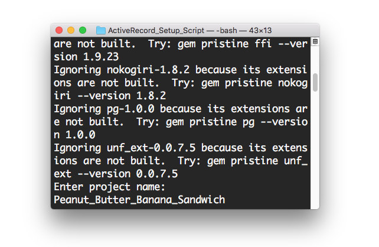
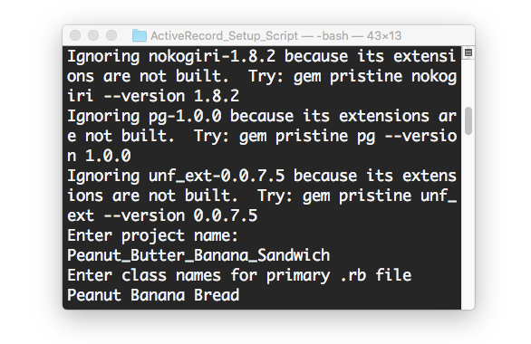
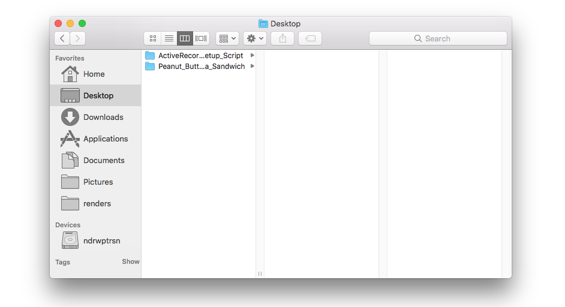

# Active Record Script


Hello there! This script will make a skeleton for your next Ruby/Sinatra/Rake app, git-free. It was written by Jared Clemensen and Andrew Peterson during Week Four Ruby Track at Epicodus. 

Enjoy.


## Instructions

**Cloning From GitHub** This part is straightforward, simply navigate to your desktop and run:

``` 
$ cd Desktop
$ git clone https://github.com/ndrwptrsn/ActiveRecord_Setup_Script.git

```

**Launch the Script** Navigate to the directory and run:

``` 
$ cd ActiveRecord_Setup_Script/
$ ./launch.rb

```

**Name your project** This will also be the name of your database. Use lower\_camel_case.

``` 
Enter project name:
> Peanut_Butter_Sandwich

```

**Name your classes** Make them singular and use Upper\_Camel_Case.

``` 
Enter class names for primary .rb file
> Peanut_Butter Banana Bread

```

**Open your project** Navigate to the root directory you created and run:

``` 
$ cd ..
$ cd Peanut_Butter_Sandwich
$ atom .

```







